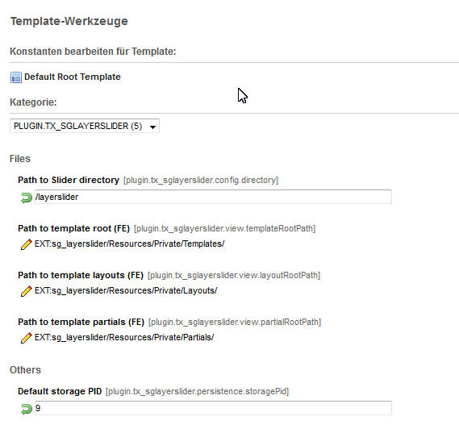

============================
Administrator Manual
============================

Installation
=============

Für die Installation der Extension wird diese mit dem Extension-Manager installiert.
Dannach wird das statische Template eingebunden.

Der benötigte Parallax Layerslider kann über Codecanyon bezogen gekauft und heruntergeladen werden.
Das Archiv (z.B. codecanyon-922100-layerslider-responsive-jquery-slider-plugin.zip) enthält alle benötigten Dateien, auch eine kompatible jquery-Version.

Das entpackte Archiv enthält das Verzeichnis LayerSlider-5.1.0 (abhängig von der Versionsnummer) mit den Unterverzeichnissen
documentation
.DS_Store
examples
layerslider
sources
start_here.html

		Konstanten im statischen Template

Configuration
=======================

Konfiguriert wird der Pfad zu den Dateien des Layerslider

Das Verzeichnis layerslider wird an eine erreichbare Stelle im Document-Root-Verzeichnnis des Webservers kopiert.
Der Dateipfad dorthin wird im Konstanten-Editor in der Zeile Path to Slider directory angegeben.

Im Feld Default storage PID wird der Ordner der TYPO3-Installation angegeben, in dem die einzelnen Slideshows zentral abgelegt werden.

