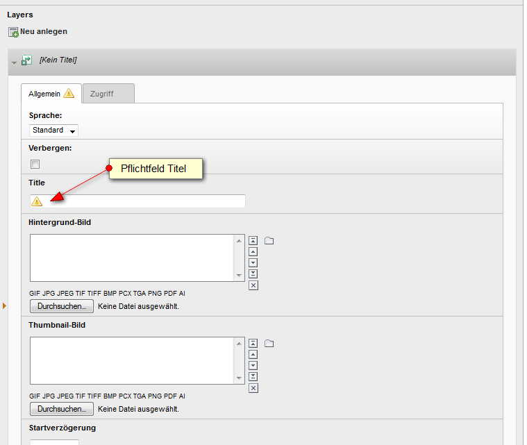

============
Users manual
============

Einfügen des Plugins
Konfiguration des Plugins
Erstellen von Layern
Erstellen von Elementen

Frontend Plugin
=====================

Das Content-Element dient dazu, einen vorbereiteten Slider anzuzeigen.

Das Layerslider Plugin fügen Sie als Allgemeines Plugin ein. Wählen Sie dann im Reiter Plugin das Layerslider Contentelement.
Im Abschnitt "Slider wählen" wählen Sie den Slider, den Sie anzeigen möchten.
Hier kann nur genau ein Slider ausgewählt werden.
Zur Auswahl stehen alle erstellten Slider (siehe Slider erstellen).

.. figure:: Images/UserManual/PluginConfig.png
	:width: 500px
	:alt: Konfiguration des Content Elements

	Konfiguration des Plugins Layerslider-Contentelement

.. csv-table:: Konfiguration des Content-Elements
    :header: "Eigenschaft","Wert","Layerslider-Doku","Beschreibung"
    :widths: 15, 10, 20, 30

    "Slider wählen","select","n.a.","Auswahl des anzuzeigenden Sliders (nur eine Auswahl möglich"
    "Autostart","check","autostart","Beginnt die Slideshow beim sofort selbständig"
    "Pause bei Hover","check","pauseonhover","Slideshow wird angehalten, wenn der Mauszeiger innerhalb der Slideshow steht"
    "Erster Layer zufällig","check","firstslide","Erster Layer wird zufällig ausgewählt. Wenn nicht gesetzt, wird immer Layer 1 verwendet."
    "Erster Layer animiert","check","animateFirstSlide","Wenn nicht gesetzt, wird der erste Layer immer statisch angezeigt, ohne Animationseffekt"
    "Anzahl Durchläufe","int","loops","Anzahl der Durchläufe des Sliders. 0 oder leer entspricht unendlich"
    "Durchläufe begrenzen","check","forceLoopNum","Die Anzahl der Durchläufe gilt auch, wenn der Slider neu gestartet wurde."
    "Bidirektional","check","towWaySlideshow","Am Ende des Durchlaufs wird die Slideshow in umgekehrter Reihenfolge angezeigt. Die Laufrichtung wechselt nach jedem Durchlauf."
    "Zufällige Reihenfolge","check","randomSlideshow","Die einzelnen Layer werden in zufälliger Reihenfolge angezeigt."
    "Responsive","check","responsive","Slider-Container responsive einbetten"
    "Responsive unter","px","responsiveUnder","Aktiviert Responsive bei Display-Größen kleiner als angegeben."
    "Breite","value","width","Breite des Slider-Bereichs, Angabe inklusive %-Symbol oder px, z.B. 800px oder 60%"
    "Höhe","value","height","Höhe des Slider-Bereichs, Angabe inklusive %-Symbol oder px"
    "Container für Layer","num","layersContainer","Container-ID für einen zusätzlichen, inneren Slider-Container."
    "CSS-Klasse","text","n.a.","Zusätzliche CSS-Klasse für den Slider-Container"
    "Globale Hintergrundfarbe","Hexwert oder Farbname","globalBGColor","Hintergrundfarbe für den Slider-Container. Farbname oder Hexwert kann verwendet werden, Defaulteinstellung 'transparent'"
    "Container Skin","skinname","skin","Alternativer Sliderskin. Default-Skin ist 'v5'."
    "Skin-Pfad","path","skinsPath","Verzeichnispfad zu den Skins. Alternativer Sliderskin muss in diesem Pfad zu finden sein."
    "Vorwärts-Rückwärts-Buttons anzeigen","check","navPrevNext","Anzeige der Buttons für Vorwärts und Rückwärts"
    "Start-Stop-Buttons anzeigen","check","navStartStop","Anzeige der Buttons für Start und Stopp"
    "Navigations-Buttons anzeigen","check","navButtons","Deaktiviert bedeutet, alle Slide-Buttons und Thumbnails werden nicht angezeigt."
    "Hover auf Vorwärts-Rückwärtsbuttons","check","hoverPrevNext","Vorwärts-Rückwärts-Buttons werden nur angezeigt, wenn sich der Mauszeiger im Slider befindet."
    "Hover auf Fuss-Navigation","check","hoverBottomNav","Slide-Navigation und Thumbnails werden nur angezeigt, wenn sich der Mauszeiger im Slider befindet."

Slider erstellen
=======================

Ein Slider kann in einem Content-Element zur Anzeige ausgewählt werden. Es können beliebig viele Slider definiert werden.

Jeder Slider enthält Layer (vergleichbar mit einzelnen Dias einer Diashow). Die Anzahl der Layer pro Slider ist nicht begrenzt.
Die Layer werden eine konfigurierbare Zeit lang angezeigt.

Ein Layer enthält mindestens ein Element, z.B. ein Image oder einen Text. Dabei kann für jedes Element festgelegt werden, wie lange es
angezeigt wird, wie überblendet wird etc.

Erstellen des Sliders
------------------------

Bei der Installation wurde ein Ordner für die Sliderinhalte angelegt (z.B. Slider).
Über die Listenansicht öffnen Sie diesen Ordner.

Erstellen Sie jetzt einen neuen Datensatz.

.. figure:: Images/UserManual/NewSlider.png
	:width: 500px

	Neuen Slider erstellen

Vergeben Sie für den soeben erstellten Slider einen Titel, und auf Wunsch eine Beschreibung.
Der Titel wird für die Identifikation des Sliders verwendet und muß deshalb eindeutig sein.
Dies ermöglicht die Ausgabe von mehreren verschiedenen Slidern auf einer Seite.

.. figure:: Images/UserManual/SliderProperties.png
    :width: 500px

    Titel und Beschreibung des Sliders festlegen

.. csv-table:: Konfiguration des Sliders
    :header: "Eigenschaft", "Wert", "Layerslider-Doku", "Beschreibung"

    "Title","<text>","n.a.","Titel des Sliders (wird nicht angezeigt)"

Zuordnen von Layern
----------------------

Einem Slider müssen Sie jetzt Layer zuordnen.
In der Bearbeiten-Maske des Sliders findet sich unten der Abschnitt "Layers" mit dem Icon "Neu anlegen".
Mit Klick auf das Icon wird ein neuer Layer angelegt und dieser gleichzeitig dem Slider zugeordnet.

    Eigenschaften des Layers festlegen

.. csv-table:: Eigenschaften des Layers
   :header: "Eigenschaft", "Wert", "Layerslider-Doku", "Beschreibung"
   :widths: 15, 10, 20, 30

    "Title","<text>","n.a.","Titel des Layers"
    "Hintergrund-Bild","<image> ","","","slidedelay","Gesamtzeit die der Layer angezeigt wird (ms)"
    "Zeitverschiebung","int","timeshift","Timingkorrektur relativ zum Layerwechsel"
    "2D-Effekt","select","transition2d","2DEffekt für den Layerwechsel. Bei mehrfachauswahl wird der Effekt zufällig aus den selektierten Effekten ausgewählt."
    "3D-Effekt","select","transition3d","wie 2D-Effekt"
    "Deeplink-Name","<text>","deeplink","Mit diesem Namen als Linkziel kann der Layer direkt per URL angesprungen werden. z.B. www.domain.de/seite.html#layer3 Der Slider beginnt sofort mit dem Layer 'layer3'"
    "Linkziel des Slides","<text>","<a href class=ls-link","Vollständige URL. Diese wird dem Layer als Link hinterlegt"

..  tip:: Der Titel des Layers wird für das Background- und Thumbnail-Image als Bestandteil des Alt-Textes verwendet.

Zuordnen von Elementen
------------------------

Einem Layer müssen Sie jetzt Elemente zuordnen.
In der Bearbeiten-Maske des Layers findet sich unten der Abschnitt "Elemente" mit dem Icon "Neu anlegen".
Mit Klick auf das Icon wird ein neues Element im jeweiligen Layer angelegt und diesem Zugeordnet.

.. figure:: Images/UserManual/ElementProperties.png
    :width: 500px

    Eigenschaften des Elements festlegen

.. csv-table:: Eigenschaften des Elements
    :header: "Eigenschaft","Wert","Layerslider-Doku","Beschreibung"
    :widths: 15, 10, 20, 30

    "Titel","<text>","n.a.","Titel des Elements"
    "Elementtext","text","n.a.","Beschriftung des Elements"
    "Textstyle","","","Inhalt des Style-Attributes für das Text-Tag"
    "Text-Tag","h1,h2,h3,h4,h5,p,div","HTML-Tag der den Text umschliesst."
    "Image","<image>","","","n.a.","Vollständige URL zum Video/Audio (htt://youtube...)"
    "Linktyp Media","Youtube, Audio (selfhosted), Video (selfhosted)","<iframe>, <video>, <audio>","Type-Einstellung für die Medium-URL"
    "Borderleft","<px>"," ","Abstand zum linken Rand"
    "Bordertop","<px>"," ","Abstand von Oben"
    "Verzögerung","ms"," ","Verzögerung zwischen Aktivierung des Elements und start des Effektes"
    "Laufzeit","ms"," ","Dauer des Effektes"
    "Haltezeit nach Effekt","ms","slidedelay","Zeit, die das Element angezeigt wird, wenn der Effekt beendet ist."
    "Überblenden","true/false"," ","Wird ein Einblende- und ein Ausblende-Effekt verwendet"
    "Beschleunigung/Abbremsen","select"," ","Geschwindigkeitsverlauf der Bewegung beim Ein- und Ausblenden"
    "Rotation In/Out","°Grad"," ","Rotationswinkel beim Ein- und Ausblenden"
    "Parallaxen-Ebene","<num>","parallaxlevel","Parallaxen-Ebene in der sich das Element (Bild oder Text) befindet."

FAQ
=====

 **Kann ich mehrere Slider auf einer Seite anzeigen?**

Ja. Das Content-Element wird dafür mehrfach eingebunden.

 **Kann ich den gleichen Slider mehrfach anzeigen?**

Auf verschiedenen Seiten: Ja.
Auf er selben Seite: Nein.

 **In welcher Reihenfolge werden die Layer abgearbeitet?**

Elemente und Layer werden nach aufsteigender UID sortiert ausgegeben. D.h. das Element bzw. der Layer mit der kleinsten
UID wird zuerst ausgegeben.

 **Die Positionierung der Elemente funktioniert nicht**

In den Feldern Borderleft und Bordertop sind sowohl px als auch % erlaubt. Deshalb muss die Einheit mit angegeben werden.